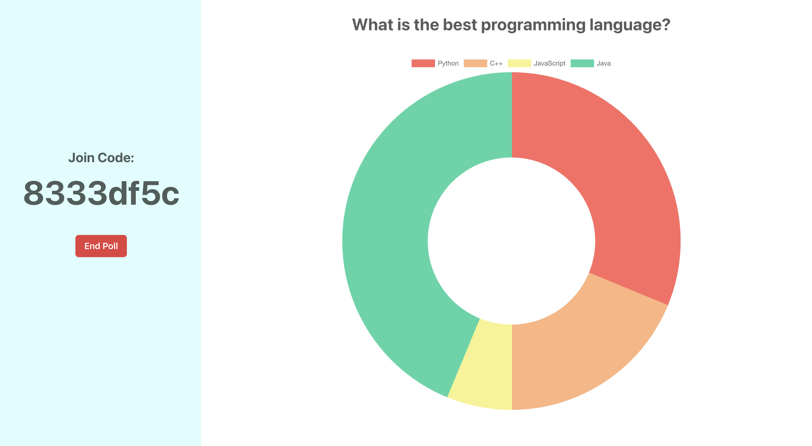

# QuikPoll

QuikPoll is a live voting app enabling users to participate in a quick and engaging decision-making process. It is built using React and ChakraUI for a dynamic and consistent frontend layout. On the backend, it utilized Node and Socket.IO to orchestrate the WebSocket communication, efficiently updating poll data and reflecting live voting results. All the results are then displayed in real-time using the Chart.js library and React Hooks for managing the state updates.